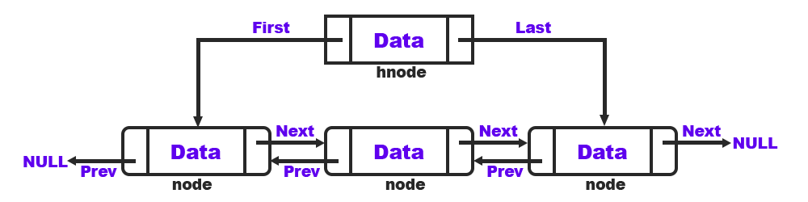

# Doubly Linked List (Implemented in C)



## Struct Node (node)
```c
typedef struct Node {
    int data;
    struct Node * next;
    struct Node * prev;
}node;

```

## Struct Hnode (hnode)

```c
typedef struct Hnode {
    int tam;
    struct Node * primeiro;
    struct Node * ultimo;
}hnode;

```

## Needed modifications to use it with any Struct

In order use the "generic" list and most of its functions, simply add the new members you want in the following structures. However, keep the following members in each of the structures at least.

**Struct Node**
>struct Node * next;

>struct Node * prev;

 **Struct Hnode**

> int tam;
    
> struct Node * primeiro;
    
> struct Node * ultimo;


**If you make changes to the `struct Node`, you have to adapt the following functions:**

* This function must returns a pointer to the new allocated node after its atributions:

	```c
	node * new_node(int valor);
	```

* This function must returns: `1` (first > second), `0` (first == second) or `-1` (first < second)

	```c
	int compare_node(node * first, node * second);
	```

* And you have to specify which members of the structure should be shown in this function:
 
	```c
	void show_node(node * no);
	```

**If you make changes to the `struct Hnode`, you have to adapt the following function:**

* You have to initilize the new members of this function that Inialize a new list and returns a pointer:
 
	```c
	void show_node(node * no);
	```

## Implemented Functions
```c
// Inserts a node at the beginning
void insert_beggining(hnode * cabeca, node * newnode);

// Inserts a node at the end
void insert_end(hnode * cabeca, node * newnode);

// Inserts a no after a specified one
void insert_after(hnode * cabeca, node * anterior, node * newnode);

// Inserts a no before a specified one
void insert_before(hnode * cabeca, node * proximo, node * newnode);

// Inserts a node sorting (based in compare_node)
void insert_sorting(hnode * cabeca, node * newnode);

// Changes the position of two nodes (changes the pointers, not the data)
void swap_nodes(hnode * cabeca, node * first, node * second);

// Removes all the nodes of a list
void remove_all(hnode * cabeca);

// Removes a specified node
void remove_node(hnode * cabeca, node * nremove);

// Shows the entire list (based in show_node)
void show_list(hnode * cabeca);

// Returns a pointer to the minimum node (based in compare_node)
node * node_min(hnode * cabeca);

// Returns a pointer to the maximum node (based in compare_node)
node * node_max(hnode * cabeca);

// Show a specified node
void show_node(node * no);

// Inialize a new list and returns a pointer
hnode * initialize_list(void);

// Compare two nodes and returns -1, 0 or 1
int compare_node(node * first, node * second);

// Creates a new node and returns a pointer
node * new_node(int valor);

// Returns a pointer to the node or NULL if it does not exist
node * search_node(hnode * cabeca, int valor);

```


